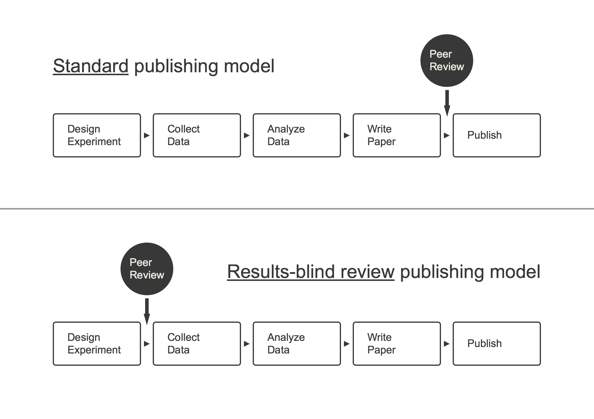
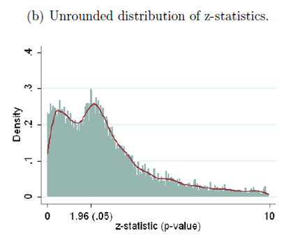
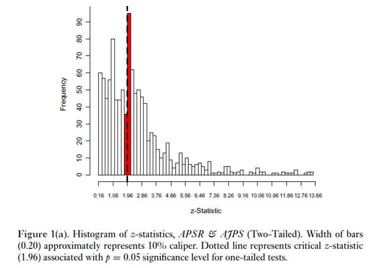

## Introduction

Special Thanks to Oscar Barriga-Cabanillas and Matthieu Stigler!

- Welcome!
  - Training 5: Transparency and Reproducibility in Research (You are here.)
  - Training 6: Data Management
  - Training 6a: Dynamic Documents

## Training 5: Transparency and Reproducibility in Research

- Is there a problem with replicability and statistical validity?
- Is there a reproducibility crisis?
- How can we counter-act this?

- Replicability
  - Not a problem of results being intentionally falsified, although there are cases
  - There is a lack of incentives to replicate / validate
- Statistical Validity
  - P-hacking
  - Multiple testing
  - Workflow
  - Null results are not a failure
- Exercises

## Replication Disincentives

## Replication Disincentives

- The persistence of David Broockman led to the discovery of data falsification
- Michael LeCour falsified the data of his thesis: 
  - Subjects interviewed about their acceptance of gay marriage
  - Treatment: Revealing interviewer's sexual orientation before asking questions 
- LeCour received an offer from Princeton because of his job as thesis, which was published in *Science* in 2014
- Received media coverage; organizations changed their policies because of this
- Many people were suspicious, but the inclusion of names recognized in the publication acted as
shielding - people wanted to believe them

## Replication Disincentives

- How did Broockman find out?
- Wanted to write a similar study; replication
- He first wanted to replicate it
- The cost and logistics were not within the reach of a grad student
  - LeCours would have to have a budget of over $1,000,000 to carry the design
    - 10,000 respondents paid $100 a piece
- Things unravelled from there...
- His own study didn't end up being consistent
- Raw data was too "orderly"

## So What?

- No incentive to carry out replications
- But there isn't much reward to questioning results
  - Either "shamelessly taking down a big name."
  - Or being unfair/critical to peers
- Until recently, not really considered "science"
- Points to structural issue
- How do we change it?

## But Also...

- That's an extreme example
- Biggest problems are the things we do as part of standard research practices
  - Cutting/subsetting/"exploring" sample until we find an "interesting" (read: stat. sig.) result
    - Or rather, not being clear about when cutting is part of our *a priori* understanding of the model vs. exploratory work
  - Not considering null results as interesting
  - Not commenting code/making it easier for someone to read/run our code
  - Not taking version control seriously (`paper_1_new_final_final2_changed_final12.docx`)

## Preview of Solutions

- > Cutting/subsetting/"exploring" sample until we find an "interesting" (read: stat. sig.) result

**Solution: Multiple Hypothesis Testing; Pre-analysis Plans**

- > Not considering null results as interesting

**Solution: Registered Reports (Also, the idea of *precise zeros*)**

- > Not commenting code/making it easier for someone to read/run our code

**Solution: dynamic documents, code commenting, docker**

- > Not taking version control seriously

**Solution: `git`**

## Null Results

The problem:

- The publication of null effects is disappearing over time, in all disciplines. (Fanelli 2011) .
- Valuable information is being lost

## Null Results

Null results are archived

- They are not published
- They are not registered

Nulls are needed to understand full distribution of results!

## 

\begin{center}
\includegraphics[]{../figures/Tess.PNG}
\end{center}

## Registered Reports

- AKA Registered Reports, change time to peer review before the data collection, analysis and results.
  - Design a study
  - Send to a journal
  - Review based on the importance of the question and design quality
  - Get acceptance
  - Run the study, and publish even with null results

\href{https://osf.io/8mpji/wiki/home/}{Hundreds of Journals Participating \beamergotobutton{Link}}

## Including...JDE!

## What's the Difference?

## Pre-registration

- And if that doesn't work, [pre-register your studies](https://www.socialscienceregistry.org/)!
- Gives credibility to work that you're doing
- Puts you "on the map" as having thought of the idea
- Can even do it for secondary data

## Precise Nulls

- A null result can be interesting too!
- How to make sure that a null result is actually **0**?
  - Review design
  - Check that no-reject is not due to a small sample with respect to the effect size 
  
::: {.admonition} :::
**Definition (Minimum detectable effect size)**

The smallest actual effect, which can be detected for a
certain level of power and statistical significance. 
:::::::::::::::::::::

## Multiple Testing

- Consequences of always looking for p-values ​​< 0.05:
  - Fraud
  - p-hacking: systematic search for significant results
  - unconscious bias: accept without criticism $H_1$, examine $H_0$ meticulously
- This usually happens through constant testing of hypotheses

## Multiple Testing

- False Positive: Rejecting $H_0$ when it is in fact not significant
- What is the probability of a false positive? Type I error: $\alpha$ (usually 5\%)
- What about with $m$ hypotheses? 
  - $R_i$ rejecting null hypothesis $i$

$P\{$at least one $H^0_i$ rejected | all $H^0_i$ correct$\}$

$$\begin{aligned}
= & 1 - P\{ \text{No rejections} \}\\
= & 1-P\{\bar{R}_{1}\cap\bar{R}_{2}\cap\ldots\cap\bar{R}_{m}|H_{i}^{0}\}\\
= & 1-(1-\alpha)^{m}\qquad\qquad\text{if independent}
\end{aligned}$$

\begin{tabular}{lccccccc}
\toprule 
\midrule 
M=\# tests: & 1 & 2 & 3 & 5 & 10 & 20 & 50\tabularnewline
\midrule
  & 5\% & 10\% & 14\% & 22\% & 40\% & 64\% & 92\%\tabularnewline
\bottomrule
\end{tabular}

## P-hacking

::: {.admonition} :::
Systematic search for significant results on
multiple combinations of i) dependent variables ii)
combinations of independent variables; reporting
only significant results.
If we test enough hypotheses it is certain that we can
reject at least one hypothesis, even if it is a false
positive!!
:::::::::::::::::::::::

## P-hacking is Real

## P-hacking is Real

## Multiple Hypothesis Testing

$$\begin{aligned}
    P\{\#R_{i}\geq1 | H_{i}^{0}\,\forall i\} = & 1 - P\{ \text{No rejections} \}\\
    = & 1-P\{\bar{R}_{1}\cap\bar{R}_{2}\cap\ldots\cap\bar{R}_{m}|H_{i}^{0}\}\\
    = & 1-(1-\alpha)^{m}\qquad\qquad\text{if independent}
\end{aligned}$$

The Bonferroni inequality:

$$
P\{\#R_{i}\geq1 | H_{i}^{0}\,\forall i\} \leq m \cdot \alpha
$$

## Multiple Hypothesis Testing

\begin{tabular}{lccccccc}
\toprule 
 & \multicolumn{6}{c}{Number of Tests}\tabularnewline
\midrule 
  & 1 & 2 & 3 & 5 & 10 & 20 \tabularnewline
\midrule
\midrule 
False Positive & 5\% & 10\% & 14\% & 22\% & 40\% & 64\% \tabularnewline
\midrule
No Adjustment &  5\% & 5\% & 5\% & 5\% & 5\% & 5\% \tabularnewline
\midrule
Bonferroni & 5\% & 2.5\%  & 1.67\% & 1.25\% & 1\% & 0.8\% \tabularnewline
\bottomrule
\end{tabular}

## Multiple Hypothesis Testing

- Controlling for false positives:
  - Bonferroni: use the Boolean inequality P {} < $\alpha \cdot m$ $\Rightarrow$ use $\alpha = \frac{\alpha}{m}$.

Problem: it is very conservative!

With $m = 50$, $\alpha = 0.001$ is used instead of 0.05!

Holmes: iterative procedure, not as conservative than Bonferroni

Control of the false discovery rate, the proportion of false
positives: Benjamini – Hochberg

## When to use it?

- When to Use multiple corrections?
  - Tables with multiple results
  - After having explored many combinations of models
- Connects to idea of pre-analysis plans
  - plan for the number of tests you'll do so that the correction doesn't cause too much of a penalty

## Pre-analysis Plans

::: {.admonition} :::
**Pre-analysis Plan**

Detailed description of the analyses to be conducted
(hypotheses, variables, equations, controls, etc): This
description is written before viewing the data.
::::::::::::::::::::::

By specifying the details before viewing the results, the
plan is a safeguard against p-hacking.

## Where do you register?

- AEA Registry, actualmente solo para RCTs. 
  - [`https://socialscienceregistry.org`](https://socialscienceregistry.org)
- EGAP  
  - [`https://egap.org/design-registration`](https://egap.org/design-registration)
- 3ie 
  - [`https://ridie.3ieimpact.org`](https://ridie.3ieimpact.org)
- Open Science Framework 
  - [`https://osf.io`](https://osf.io)

##

\begin{center}
\includegraphics[]{../figures/preregisrtation_Med_effectiveness_trials.jpg}
\end{center}

## Pre-analysis Plans

In a pre-analysis plan, a very clear distinction is made
between two types of analysis:

- Confirmatory analysis : test the pre-registered hypotheses. If it is well done, it balances the false positive problem and which hypotheses are most important.
- Exploratory analysis : results not pre-registered. They come in a different section, and have less credibility (could be false positives). 

## OSF

\begin{center}
\includegraphics[]{../figures/osf_home.png}
\end{center}

## OSF

- "One-stop Shop" for Research
- Provides Integration with Github, cloud services 
- Keeps track of your project and files changing
- **An easy place to write Pre-Analysis Plans and Registered Reports!**

## Exercise

- Take the time now to start a registered report, pre-registration or pre-analysis plan  for your own project.